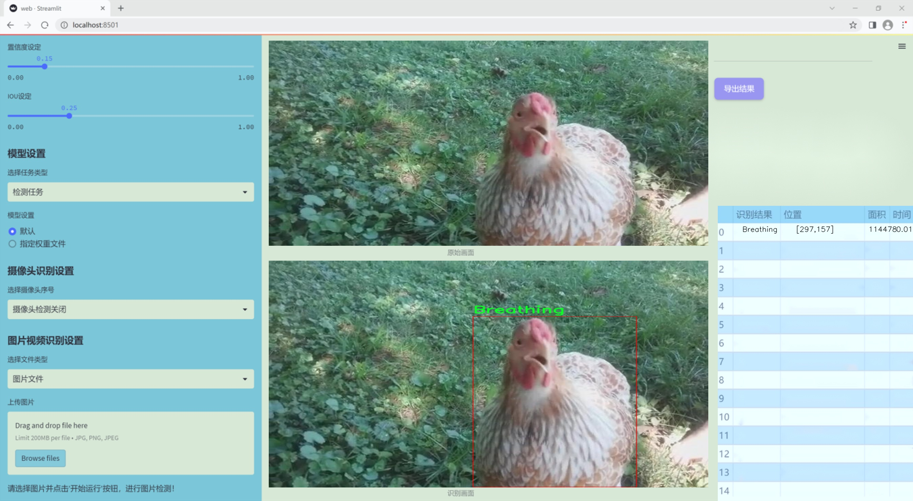
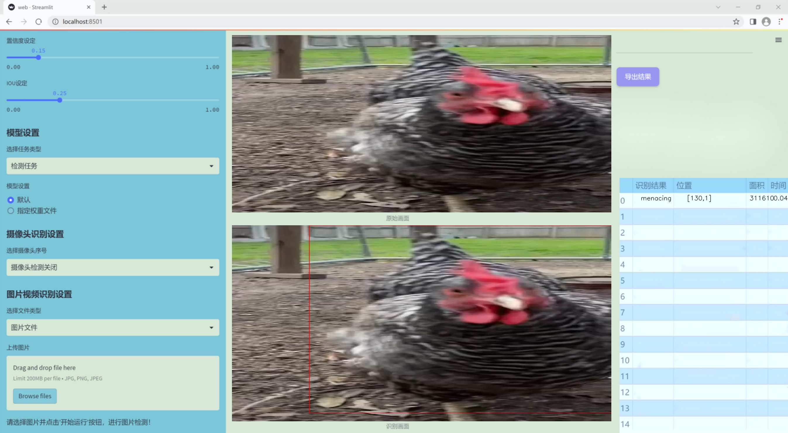
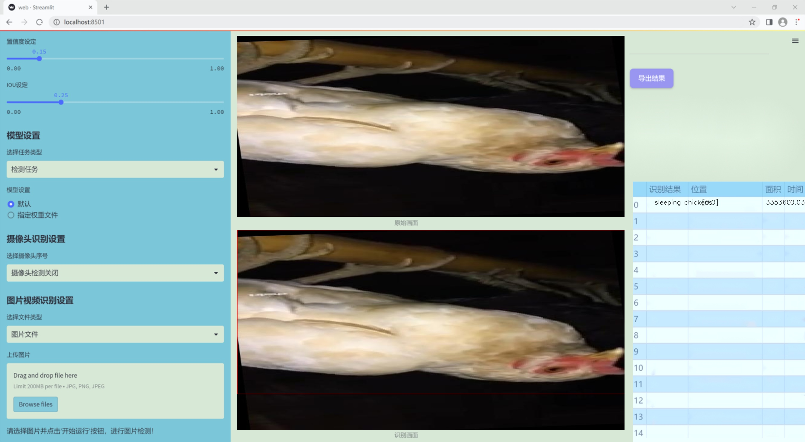
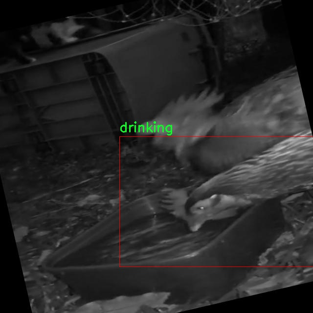
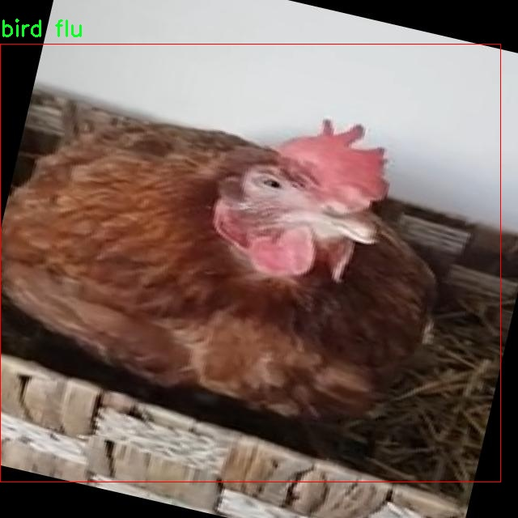
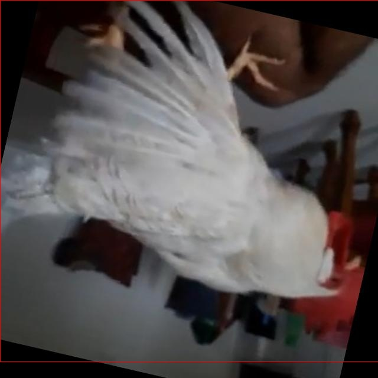
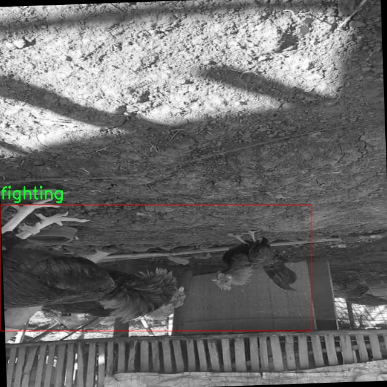
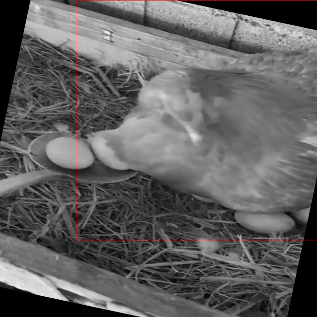

### 1.背景意义

研究背景与意义

随着全球对食品安全和动物福利的关注日益增加，养殖业的可持续发展成为了亟待解决的重要课题。鸡只作为一种重要的经济动物，其健康状况直接影响到养殖效益和食品安全。因此，实时监测和评估鸡只的行为健康状况显得尤为重要。传统的人工观察方法不仅耗时耗力，而且容易受到观察者主观因素的影响，难以实现高效、准确的健康评估。基于计算机视觉的自动化监测系统应运而生，能够通过图像分析技术，实时识别和评估鸡只的行为，进而为养殖管理提供科学依据。

本研究旨在基于改进的YOLOv11模型，构建一个高效的鸡只行为健康状况识别系统。该系统将利用一个包含2455张图像的数据集，涵盖21种不同的鸡只行为类别，如呼吸、饮水、进食、打斗等。这些行为的监测不仅能够帮助养殖户及时发现潜在的健康问题，如禽流感和新城疫等疾病，还能优化养殖环境，提升鸡只的生长效率和存活率。

通过对鸡只行为的自动识别和分析，研究将为养殖场提供实时的数据支持，帮助养殖户更好地管理鸡只的健康状况。此外，改进的YOLOv11模型在精度和速度上的提升，将为计算机视觉在农业领域的应用提供新的思路和方法。综上所述，本研究不仅具有重要的学术价值，也将为养殖业的智能化发展提供有力的技术支持，推动农业现代化进程。

### 2.视频效果

[2.1 视频效果](https://www.bilibili.com/video/BV1NPUGYzEXw/)

### 3.图片效果







##### [项目涉及的源码数据来源链接](https://kdocs.cn/l/cszuIiCKVNis)**

注意：本项目提供训练的数据集和训练教程,由于版本持续更新,暂不提供权重文件（best.pt）,请按照6.训练教程进行训练后实现上图演示的效果。

### 4.数据集信息

##### 4.1 本项目数据集类别数＆类别名

nc: 21
names: ['Breathing', 'abnormal chicken', 'allo preening', 'bird flu', 'crouch chicken', 'dead', 'drinking', 'feeding', 'fighting', 'leg stretching', 'menacing', 'newcastle', 'pecking', 'running', 'self preening', 'sleeping chickens', 'stand bath', 'walking', 'wing and leg stretching', 'wing flap', 'wingstretching']


该项目为【目标检测】数据集，请在【训练教程和Web端加载模型教程（第三步）】这一步的时候按照【目标检测】部分的教程来训练

##### 4.2 本项目数据集信息介绍

本项目数据集信息介绍

本项目旨在改进YOLOv11模型，以实现对养殖场鸡只行为健康状况的高效识别。为此，我们构建了一个涵盖21种不同鸡只行为的数据集，专注于“chickens behaviours”这一主题。该数据集的设计旨在为机器学习模型提供丰富的训练样本，以便更准确地识别和分类鸡只的各种行为，从而为养殖场的管理和健康监测提供科学依据。

数据集中包含的行为类别包括：Breathing（呼吸）、abnormal chicken（异常鸡只）、allo preening（互相梳理）、bird flu（禽流感）、crouch chicken（蹲伏鸡只）、dead（死亡）、drinking（饮水）、feeding（进食）、fighting（打斗）、leg stretching（腿部伸展）、menacing（威胁行为）、newcastle（新城疫）、pecking（啄食）、running（奔跑）、self preening（自我梳理）、sleeping chickens（睡眠中的鸡只）、stand bath（站立洗澡）、walking（行走）、wing and leg stretching（翅膀和腿部伸展）、wing flap（翅膀拍打）、wingstretching（翅膀伸展）。这些类别涵盖了鸡只在日常生活中可能表现出的多种行为，能够有效反映其健康状况和生活环境。

数据集的构建过程中，我们采用了多种数据采集手段，包括视频监控和现场观察，以确保样本的多样性和代表性。每个行为类别都经过精心标注，确保模型在训练过程中能够学习到每种行为的特征。通过对这些行为的分析，我们希望能够为养殖场提供实时的健康监测工具，帮助养殖者及时发现潜在的健康问题，从而提高养殖效率和动物福利。最终，我们期望该系统能够在实际应用中发挥重要作用，为现代养殖业的可持续发展贡献力量。











### 5.全套项目环境部署视频教程（零基础手把手教学）

[5.1 所需软件PyCharm和Anaconda安装教程（第一步）](https://www.bilibili.com/video/BV1BoC1YCEKi/?spm_id_from=333.999.0.0&vd_source=bc9aec86d164b67a7004b996143742dc)


[5.2 安装Python虚拟环境创建和依赖库安装视频教程（第二步）](https://www.bilibili.com/video/BV1ZoC1YCEBw?spm_id_from=333.788.videopod.sections&vd_source=bc9aec86d164b67a7004b996143742dc)

### 6.改进YOLOv11训练教程和Web_UI前端加载模型教程（零基础手把手教学）

[6.1 改进YOLOv11训练教程和Web_UI前端加载模型教程（第三步）](https://www.bilibili.com/video/BV1BoC1YCEhR?spm_id_from=333.788.videopod.sections&vd_source=bc9aec86d164b67a7004b996143742dc)


按照上面的训练视频教程链接加载项目提供的数据集，运行train.py即可开始训练



     Epoch   gpu_mem       box       obj       cls    labels  img_size
     1/200     20.8G   0.01576   0.01955  0.007536        22      1280: 100%|██████████| 849/849 [14:42<00:00,  1.04s/it]
               Class     Images     Labels          P          R     mAP@.5 mAP@.5:.95: 100%|██████████| 213/213 [01:14<00:00,  2.87it/s]
                 all       3395      17314      0.994      0.957      0.0957      0.0843

     Epoch   gpu_mem       box       obj       cls    labels  img_size
     2/200     20.8G   0.01578   0.01923  0.007006        22      1280: 100%|██████████| 849/849 [14:44<00:00,  1.04s/it]
               Class     Images     Labels          P          R     mAP@.5 mAP@.5:.95: 100%|██████████| 213/213 [01:12<00:00,  2.95it/s]
                 all       3395      17314      0.996      0.956      0.0957      0.0845

     Epoch   gpu_mem       box       obj       cls    labels  img_size
     3/200     20.8G   0.01561    0.0191  0.006895        27      1280: 100%|██████████| 849/849 [10:56<00:00,  1.29it/s]
               Class     Images     Labels          P          R     mAP@.5 mAP@.5:.95: 100%|███████   | 187/213 [00:52<00:00,  4.04it/s]
                 all       3395      17314      0.996      0.957      0.0957      0.0845


###### [项目数据集下载链接](https://kdocs.cn/l/cszuIiCKVNis)

### 7.原始YOLOv11算法讲解


##### YOLO11介绍

Ultralytics YOLO11是一款尖端的、最先进的模型，它在之前YOLO版本成功的基础上进行了构建，并引入了新功能和改进，以进一步提升性能和灵活性。
**YOLO11设计快速、准确且易于使用，使其成为各种物体检测和跟踪、实例分割、图像分类以及姿态估计任务的绝佳选择。**


**结构图如下：**


##### **C3k2**

**C3k2，结构图如下**


**C3k2，继承自类`C2f，其中通过c3k设置False或者Ture来决定选择使用C3k还是`**Bottleneck


**实现代码** **ultralytics/nn/modules/block.py**

##### C2PSA介绍

**借鉴V10 PSA结构，实现了C2PSA和C2fPSA，最终选择了基于C2的C2PSA（可能涨点更好？）**


**实现代码** **ultralytics/nn/modules/block.py**

##### Detect介绍

**分类检测头引入了DWConv（更加轻量级，为后续二次创新提供了改进点），结构图如下（和V8的区别）：**


### 8.200+种全套改进YOLOV11创新点原理讲解

#### 8.1 200+种全套改进YOLOV11创新点原理讲解大全

由于篇幅限制，每个创新点的具体原理讲解就不全部展开，具体见下列网址中的改进模块对应项目的技术原理博客网址【Blog】（创新点均为模块化搭建，原理适配YOLOv5~YOLOv11等各种版本）

[改进模块技术原理博客【Blog】网址链接](https://gitee.com/qunmasj/good)


#### 8.2 精选部分改进YOLOV11创新点原理讲解

###### 这里节选部分改进创新点展开原理讲解(完整的改进原理见上图和[改进模块技术原理博客链接](https://gitee.com/qunmasj/good)【如果此小节的图加载失败可以通过CSDN或者Github搜索该博客的标题访问原始博客，原始博客图片显示正常】


#### 特征融合

模型架构图如下

  Darknet-53的特点可以这样概括：（Conv卷积模块+Residual Block残差块）串行叠加4次

  Conv卷积层+Residual Block残差网络就被称为一个stage


上面红色指出的那个，原始的Darknet-53里面有一层 卷积，在YOLOv11里面，把一层卷积移除了

为什么移除呢？

        原始Darknet-53模型中间加的这个卷积层做了什么？滤波器（卷积核）的个数从 上一个卷积层的512个，先增加到1024个卷积核，然后下一层卷积的卷积核的个数又降低到512个

        移除掉这一层以后，少了1024个卷积核，就可以少做1024次卷积运算，同时也少了1024个3×3的卷积核的参数，也就是少了9×1024个参数需要拟合。这样可以大大减少了模型的参数，（相当于做了轻量化吧）

        移除掉这个卷积层，可能是因为作者发现移除掉这个卷积层以后，模型的score有所提升，所以才移除掉的。为什么移除掉以后，分数有所提高呢？可能是因为多了这些参数就容易，参数过多导致模型在训练集删过拟合，但是在测试集上表现很差，最终模型的分数比较低。你移除掉这个卷积层以后，参数减少了，过拟合现象不那么严重了，泛化能力增强了。当然这个是，拿着你做实验的结论，反过来再找补，再去强行解释这种现象的合理性。


通过MMdetection官方绘制册这个图我们可以看到，进来的这张图片经过一个“Feature Pyramid Network(简称FPN)”，然后最后的P3、P4、P5传递给下一层的Neck和Head去做识别任务。 PAN（Path Aggregation Network）


“FPN是自顶向下，将高层的强语义特征传递下来。PAN就是在FPN的后面添加一个自底向上的金字塔，对FPN补充，将低层的强定位特征传递上去，

FPN是自顶（小尺寸，卷积次数多得到的结果，语义信息丰富）向下（大尺寸，卷积次数少得到的结果），将高层的强语义特征传递下来，对整个金字塔进行增强，不过只增强了语义信息，对定位信息没有传递。PAN就是针对这一点，在FPN的后面添加一个自底（卷积次数少，大尺寸）向上（卷积次数多，小尺寸，语义信息丰富）的金字塔，对FPN补充，将低层的强定位特征传递上去，又被称之为“双塔战术”。

FPN层自顶向下传达强语义特征，而特征金字塔则自底向上传达强定位特征，两两联手，从不同的主干层对不同的检测层进行参数聚合,这样的操作确实很皮。
#### 自底向上增强


而 PAN（Path Aggregation Network）是对 FPN 的一种改进，它的设计理念是在 FPN 后面添加一个自底向上的金字塔。PAN 引入了路径聚合的方式，通过将浅层特征图（低分辨率但语义信息较弱）和深层特征图（高分辨率但语义信息丰富）进行聚合，并沿着特定的路径传递特征信息，将低层的强定位特征传递上去。这样的操作能够进一步增强多尺度特征的表达能力，使得 PAN 在目标检测任务中表现更加优秀。


### Gold-YOLO简介
YOLO系列模型面世至今已有8年，由于其优异的性能，已成为目标检测领域的标杆。在系列模型经过十多个不同版本的改进发展逐渐稳定完善的今天，研究人员更多关注于单个计算模块内结构的精细调整，或是head部分和训练方法上的改进。但这并不意味着现有模式已是最优解。

当前YOLO系列模型通常采用类FPN方法进行信息融合，而这一结构在融合跨层信息时存在信息损失的问题。针对这一问题，我们提出了全新的信息聚集-分发（Gather-and-Distribute Mechanism）GD机制，通过在全局视野上对不同层级的特征进行统一的聚集融合并分发注入到不同层级中，构建更加充分高效的信息交互融合机制，并基于GD机制构建了Gold-YOLO。在COCO数据集中，我们的Gold-YOLO超越了现有的YOLO系列，实现了精度-速度曲线上的SOTA。


精度和速度曲线（TensorRT7）


精度和速度曲线（TensorRT8）
传统YOLO的问题
在检测模型中，通常先经过backbone提取得到一系列不同层级的特征，FPN利用了backbone的这一特点，构建了相应的融合结构：不层级的特征包含着不同大小物体的位置信息，虽然这些特征包含的信息不同，但这些特征在相互融合后能够互相弥补彼此缺失的信息，增强每一层级信息的丰富程度，提升网络性能。

原始的FPN结构由于其层层递进的信息融合模式，使得相邻层的信息能够充分融合，但也导致了跨层信息融合存在问题：当跨层的信息进行交互融合时，由于没有直连的交互通路，只能依靠中间层充当“中介”进行融合，导致了一定的信息损失。之前的许多工作中都关注到了这一问题，而解决方案通常是通过添加shortcut增加更多的路径，以增强信息流动。

然而传统的FPN结构即便改进后，由于网络中路径过多，且交互方式不直接，基于FPN思想的信息融合结构仍然存在跨层信息交互困难和信息损失的问题。

#### Gold-YOLO：全新的信息融合交互机制


#### Gold-YOLO架构
参考该博客提出的一种全新的信息交互融合机制：信息聚集-分发机制(Gather-and-Distribute Mechanism)。该机制通过在全局上融合不同层次的特征得到全局信息，并将全局信息注入到不同层级的特征中，实现了高效的信息交互和融合。在不显著增加延迟的情况下GD机制显著增强了Neck部分的信息融合能力，提高了模型对不同大小物体的检测能力。

GD机制通过三个模块实现：信息对齐模块(FAM)、信息融合模块(IFM)和信息注入模块(Inject)。

信息对齐模块负责收集并对齐不同层级不同大小的特征

信息融合模块通过使用卷积或Transformer算子对对齐后的的特征进行融合，得到全局信息

信息注入模块将全局信息注入到不同层级中

在Gold-YOLO中，针对模型需要检测不同大小的物体的需要，并权衡精度和速度，我们构建了两个GD分支对信息进行融合：低层级信息聚集-分发分支(Low-GD)和高层级信息聚集-分发分支(High-GD)，分别基于卷积和transformer提取和融合特征信息。

此外,为了促进局部信息的流动，我们借鉴现有工作，构建了一个轻量级的邻接层融合模块，该模块在局部尺度上结合了邻近层的特征，进一步提升了模型性能。我们还引入并验证了预训练方法对YOLO模型的有效性，通过在ImageNet 1K上使用MAE方法对主干进行预训练，显著提高了模型的收敛速度和精度。


### 9.系统功能展示

图9.1.系统支持检测结果表格显示

  图9.2.系统支持置信度和IOU阈值手动调节

  图9.3.系统支持自定义加载权重文件best.pt(需要你通过步骤5中训练获得)

  图9.4.系统支持摄像头实时识别

  图9.5.系统支持图片识别

  图9.6.系统支持视频识别

  图9.7.系统支持识别结果文件自动保存

  图9.8.系统支持Excel导出检测结果数据


### 10. YOLOv11核心改进源码讲解

#### 10.1 mobilenetv4.py

以下是对代码的核心部分进行分析和详细注释的结果：

```python
import torch
import torch.nn as nn

# 定义模型规格，包括不同大小的MobileNetV4模型的层配置
MODEL_SPECS = {
    "MobileNetV4ConvSmall": MNV4ConvSmall_BLOCK_SPECS,
    "MobileNetV4ConvMedium": MNV4ConvMedium_BLOCK_SPECS,
    "MobileNetV4ConvLarge": MNV4ConvLarge_BLOCK_SPECS,
    "MobileNetV4HybridMedium": MNV4HybridConvMedium_BLOCK_SPECS,
    "MobileNetV4HybridLarge": MNV4HybridConvLarge_BLOCK_SPECS,
}

def conv_2d(inp, oup, kernel_size=3, stride=1, groups=1, bias=False, norm=True, act=True):
    """
    创建一个2D卷积层，包含卷积、批归一化和激活函数（ReLU6）。
    
    Args:
        inp: 输入通道数
        oup: 输出通道数
        kernel_size: 卷积核大小
        stride: 步幅
        groups: 分组卷积
        bias: 是否使用偏置
        norm: 是否使用批归一化
        act: 是否使用激活函数

    Returns:
        nn.Sequential: 包含卷积层、批归一化和激活函数的序列
    """
    conv = nn.Sequential()
    padding = (kernel_size - 1) // 2  # 计算填充
    conv.add_module('conv', nn.Conv2d(inp, oup, kernel_size, stride, padding, bias=bias, groups=groups))
    if norm:
        conv.add_module('BatchNorm2d', nn.BatchNorm2d(oup))  # 添加批归一化
    if act:
        conv.add_module('Activation', nn.ReLU6())  # 添加ReLU6激活函数
    return conv

class InvertedResidual(nn.Module):
    """
    反向残差块，包含扩展卷积、深度卷积和逐点卷积。
    """
    def __init__(self, inp, oup, stride, expand_ratio, act=False):
        super(InvertedResidual, self).__init__()
        self.stride = stride
        assert stride in [1, 2]  # 步幅只能是1或2
        hidden_dim = int(round(inp * expand_ratio))  # 计算隐藏层维度
        self.block = nn.Sequential()
        if expand_ratio != 1:
            self.block.add_module('exp_1x1', conv_2d(inp, hidden_dim, kernel_size=1, stride=1))  # 扩展卷积
        self.block.add_module('conv_3x3', conv_2d(hidden_dim, hidden_dim, kernel_size=3, stride=stride, groups=hidden_dim))  # 深度卷积
        self.block.add_module('red_1x1', conv_2d(hidden_dim, oup, kernel_size=1, stride=1, act=act))  # 逐点卷积
        self.use_res_connect = self.stride == 1 and inp == oup  # 判断是否使用残差连接

    def forward(self, x):
        if self.use_res_connect:
            return x + self.block(x)  # 使用残差连接
        else:
            return self.block(x)

class MobileNetV4(nn.Module):
    """
    MobileNetV4模型的主类，构建不同层次的网络结构。
    """
    def __init__(self, model):
        super().__init__()
        assert model in MODEL_SPECS.keys()  # 确保模型名称有效
        self.model = model
        self.spec = MODEL_SPECS[self.model]  # 获取模型规格

        # 构建各层
        self.conv0 = build_blocks(self.spec['conv0'])
        self.layer1 = build_blocks(self.spec['layer1'])
        self.layer2 = build_blocks(self.spec['layer2'])
        self.layer3 = build_blocks(self.spec['layer3'])
        self.layer4 = build_blocks(self.spec['layer4'])
        self.layer5 = build_blocks(self.spec['layer5'])
        self.features = nn.ModuleList([self.conv0, self.layer1, self.layer2, self.layer3, self.layer4, self.layer5])  # 将所有层放入ModuleList

    def forward(self, x):
        """
        前向传播，返回特征图。
        """
        input_size = x.size(2)
        scale = [4, 8, 16, 32]  # 选择特征图的缩放比例
        features = [None, None, None, None]
        for f in self.features:
            x = f(x)  # 通过每一层
            if input_size // x.size(2) in scale:
                features[scale.index(input_size // x.size(2))] = x  # 保存特征图
        return features

# 各种MobileNetV4模型的构造函数
def MobileNetV4ConvSmall():
    return MobileNetV4('MobileNetV4ConvSmall')

def MobileNetV4ConvMedium():
    return MobileNetV4('MobileNetV4ConvMedium')

def MobileNetV4ConvLarge():
    return MobileNetV4('MobileNetV4ConvLarge')

def MobileNetV4HybridMedium():
    return MobileNetV4('MobileNetV4HybridMedium')

def MobileNetV4HybridLarge():
    return MobileNetV4('MobileNetV4HybridLarge')

if __name__ == '__main__':
    model = MobileNetV4ConvSmall()  # 实例化小型MobileNetV4模型
    inputs = torch.randn((1, 3, 640, 640))  # 创建输入张量
    res = model(inputs)  # 前向传播
    for i in res:
        print(i.size())  # 打印输出特征图的尺寸
```

### 代码核心部分分析
1. **模型规格定义**：`MODEL_SPECS` 字典定义了不同类型的 MobileNetV4 模型的层配置，便于后续构建模型。
2. **卷积层构建**：`conv_2d` 函数用于创建包含卷积、批归一化和激活函数的序列，简化了模型的构建过程。
3. **反向残差块**：`InvertedResidual` 类实现了 MobileNetV4 的核心模块，包含扩展卷积、深度卷积和逐点卷积，并支持残差连接。
4. **MobileNetV4 类**：主模型类，负责根据指定的模型规格构建各层，并实现前向传播，返回特征图。
5. **模型实例化**：提供了多种 MobileNetV4 模型的构造函数，方便用户根据需求选择不同的模型。

这些核心部分构成了 MobileNetV4 的基础，能够有效地进行图像分类等任务。

这个文件定义了一个名为 `MobileNetV4` 的深度学习模型，主要用于图像分类任务。它是 MobileNet 系列模型的一个变种，采用了轻量级的卷积神经网络结构，适合在资源受限的设备上运行。文件中包含了模型的不同配置（如小型、中型、大型等），并定义了构建这些模型所需的各种层和模块。

首先，文件导入了必要的库，包括 `torch` 和 `torch.nn`，并定义了一些模型的规格，包括 `MobileNetV4ConvSmall`、`MobileNetV4ConvMedium`、`MobileNetV4ConvLarge`、`MobileNetV4HybridMedium` 和 `MobileNetV4HybridLarge`。这些规格以字典的形式存储，包含了每一层的名称、块的数量以及每个块的具体参数。

接下来，文件定义了一个 `make_divisible` 函数，用于确保模型中所有层的通道数都是8的倍数。这是为了提高模型的效率和兼容性，特别是在使用某些硬件加速时。

然后，定义了一个 `conv_2d` 函数，用于创建一个包含卷积层、批归一化层和激活函数的序列模块。这个函数的参数允许用户自定义输入和输出通道数、卷积核大小、步幅等。

`InvertedResidual` 类实现了反向残差块，这是一种特殊的卷积块，能够有效地捕捉特征并减少计算量。它包含了扩展卷积、深度卷积和投影卷积的组合，并根据输入和输出通道数决定是否使用残差连接。

`UniversalInvertedBottleneckBlock` 类则实现了通用的反向瓶颈块，支持不同的卷积核大小和下采样选项，提供了更大的灵活性。

`build_blocks` 函数根据给定的层规格构建相应的层。它根据块的类型（如 `convbn`、`uib`、`fused_ib`）调用相应的构建函数，生成包含多个卷积块的序列。

`MobileNetV4` 类是模型的主类，它根据传入的模型名称初始化相应的层。构造函数中调用 `build_blocks` 函数为每一层构建模块，并将它们存储在一个 `ModuleList` 中。`forward` 方法定义了模型的前向传播过程，返回不同尺度的特征图。

最后，文件提供了几个函数，用于创建不同配置的 MobileNetV4 模型，并在主程序中测试了 `MobileNetV4ConvSmall` 模型的输出。通过生成随机输入并打印输出特征图的尺寸，验证了模型的构建和前向传播的正确性。

整体而言，这个文件实现了一个灵活且高效的 MobileNetV4 模型，适用于各种深度学习任务，特别是在移动设备和边缘计算环境中。

#### 10.2 CSwomTramsformer.py

以下是经过简化并添加详细中文注释的核心代码部分：

```python
import torch
import torch.nn as nn
import numpy as np

class Mlp(nn.Module):
    """多层感知机（MLP）模块"""
    def __init__(self, in_features, hidden_features=None, out_features=None, act_layer=nn.GELU, drop=0.):
        super().__init__()
        out_features = out_features or in_features  # 输出特征数默认为输入特征数
        hidden_features = hidden_features or in_features  # 隐藏层特征数默认为输入特征数
        self.fc1 = nn.Linear(in_features, hidden_features)  # 第一层线性变换
        self.act = act_layer()  # 激活函数
        self.fc2 = nn.Linear(hidden_features, out_features)  # 第二层线性变换
        self.drop = nn.Dropout(drop)  # Dropout层

    def forward(self, x):
        """前向传播"""
        x = self.fc1(x)  # 线性变换
        x = self.act(x)  # 激活
        x = self.drop(x)  # Dropout
        x = self.fc2(x)  # 线性变换
        x = self.drop(x)  # Dropout
        return x

class CSWinBlock(nn.Module):
    """CSWin Transformer中的一个块"""
    def __init__(self, dim, num_heads, mlp_ratio=4., drop=0., attn_drop=0., norm_layer=nn.LayerNorm):
        super().__init__()
        self.dim = dim  # 输入特征维度
        self.num_heads = num_heads  # 注意力头数
        self.mlp_ratio = mlp_ratio  # MLP的隐藏层比率
        self.qkv = nn.Linear(dim, dim * 3)  # 线性变换用于生成Q、K、V
        self.norm1 = norm_layer(dim)  # 归一化层
        self.attn = LePEAttention(dim, num_heads=num_heads)  # 注意力机制
        self.mlp = Mlp(in_features=dim, hidden_features=int(dim * mlp_ratio), out_features=dim)  # MLP
        self.norm2 = norm_layer(dim)  # 归一化层

    def forward(self, x):
        """前向传播"""
        x = self.norm1(x)  # 归一化
        qkv = self.qkv(x).reshape(x.shape[0], -1, 3, self.dim).permute(2, 0, 1, 3)  # 生成Q、K、V
        attn_output = self.attn(qkv)  # 注意力输出
        x = x + attn_output  # 残差连接
        x = x + self.mlp(self.norm2(x))  # MLP和残差连接
        return x

class CSWinTransformer(nn.Module):
    """CSWin Transformer模型"""
    def __init__(self, img_size=640, in_chans=3, num_classes=1000, embed_dim=96, depth=[2, 2, 6, 2], num_heads=12):
        super().__init__()
        self.num_classes = num_classes
        self.embed_dim = embed_dim  # 嵌入维度

        # 第一阶段的卷积嵌入
        self.stage1_conv_embed = nn.Sequential(
            nn.Conv2d(in_chans, embed_dim, kernel_size=7, stride=4, padding=2),
            nn.LayerNorm(embed_dim)
        )

        # 构建多个CSWinBlock
        self.stage1 = nn.ModuleList([
            CSWinBlock(dim=embed_dim, num_heads=num_heads) for _ in range(depth[0])
        ])
        # 后续阶段的块可以类似构建

    def forward(self, x):
        """前向传播"""
        x = self.stage1_conv_embed(x)  # 卷积嵌入
        for blk in self.stage1:
            x = blk(x)  # 通过每个块
        return x

# 示例：创建一个CSWin Transformer模型并进行前向传播
if __name__ == '__main__':
    inputs = torch.randn((1, 3, 640, 640))  # 随机输入
    model = CSWinTransformer()  # 创建模型
    res = model(inputs)  # 前向传播
    print(res.size())  # 输出结果的尺寸
```

### 代码注释说明：
1. **Mlp类**：实现了一个多层感知机，包含两个线性层和一个激活函数，支持Dropout。
2. **CSWinBlock类**：实现了CSWin Transformer中的一个基本块，包含注意力机制和MLP，支持残差连接。
3. **CSWinTransformer类**：实现了整个CSWin Transformer模型，包含卷积嵌入和多个CSWinBlock的堆叠。
4. **主函数**：示例代码用于创建模型并进行前向传播，输出结果的尺寸。

这个程序文件 `CSWinTransformer.py` 实现了一个名为 CSWin Transformer 的视觉变换器模型，主要用于图像分类等计算机视觉任务。该模型的设计灵感来源于 Transformer 架构，并结合了图像处理的特性，能够有效地处理图像数据。

文件开头包含了一些版权信息和必要的库导入，包括 PyTorch 和一些用于模型构建的辅助函数。接下来，定义了一些模型的基本组件。

首先，`Mlp` 类实现了一个多层感知机（MLP），它包含两个线性层和一个激活函数（默认为 GELU），用于在 Transformer 的每个块中进行特征变换。

`LePEAttention` 类实现了局部增强注意力机制（LePE Attention），这是 CSWin Transformer 的核心部分。它通过将输入图像分割成窗口，并在这些窗口上计算注意力来增强模型的表达能力。该类中定义了多个方法，包括将图像转换为窗口的 `im2cswin` 方法，以及计算局部增强特征的 `get_lepe` 方法。

`CSWinBlock` 类是 CSWin Transformer 的基本构建块，包含了注意力层和 MLP 层。它根据输入的分辨率和其他参数来构建不同的分支，进行特征提取和变换。

`img2windows` 和 `windows2img` 函数用于将图像和窗口之间进行转换，帮助实现窗口化的操作。

`Merge_Block` 类用于在不同阶段之间合并特征，通常是通过卷积操作来降低特征图的分辨率。

`CSWinTransformer` 类是整个模型的主类，负责构建模型的各个阶段。它包含了多个 CSWinBlock 和 Merge_Block 的实例，并定义了前向传播的方法。模型的输入为图像，输出为特征图。

在模型的初始化过程中，定义了不同阶段的参数，如嵌入维度、深度、头数等。通过循环构建每个阶段的块，并在每个阶段之间进行特征合并。

此外，文件中还包含了一些用于加载预训练权重的函数，如 `update_weight` 和 `_conv_filter`，以及用于创建不同规模模型的函数（如 `CSWin_tiny`、`CSWin_small`、`CSWin_base` 和 `CSWin_large`）。

最后，在 `__main__` 部分，代码展示了如何实例化不同规模的 CSWin Transformer 模型，并对随机生成的输入进行前向传播，输出各个阶段的特征图的尺寸。

总体而言，这个文件实现了一个复杂的视觉变换器模型，结合了图像处理的特性和 Transformer 的优势，适用于各种计算机视觉任务。

#### 10.3 afpn.py

以下是保留的核心代码部分，并附上详细的中文注释：

```python
import torch
import torch.nn as nn
import torch.nn.functional as F
from ..modules.conv import Conv

# 定义基本的卷积块
class BasicBlock(nn.Module):
    def __init__(self, filter_in, filter_out):
        super(BasicBlock, self).__init__()
        # 定义两个卷积层
        self.conv1 = Conv(filter_in, filter_out, 3)  # 第一个卷积层，3x3卷积
        self.conv2 = Conv(filter_out, filter_out, 3, act=False)  # 第二个卷积层，3x3卷积，不使用激活函数

    def forward(self, x):
        residual = x  # 保存输入，用于残差连接
        out = self.conv1(x)  # 通过第一个卷积层
        out = self.conv2(out)  # 通过第二个卷积层
        out += residual  # 残差连接
        return self.conv1.act(out)  # 返回经过激活函数的输出


# 定义上采样模块
class Upsample(nn.Module):
    def __init__(self, in_channels, out_channels, scale_factor=2):
        super(Upsample, self).__init__()
        # 定义上采样操作
        self.upsample = nn.Sequential(
            Conv(in_channels, out_channels, 1),  # 1x1卷积
            nn.Upsample(scale_factor=scale_factor, mode='bilinear')  # 双线性插值上采样
        )

    def forward(self, x):
        return self.upsample(x)  # 返回上采样后的输出


# 定义下采样模块
class Downsample_x2(nn.Module):
    def __init__(self, in_channels, out_channels):
        super(Downsample_x2, self).__init__()
        # 定义2倍下采样
        self.downsample = Conv(in_channels, out_channels, 2, 2, 0)  # 步幅为2的卷积

    def forward(self, x):
        return self.downsample(x)  # 返回下采样后的输出


# 定义自适应特征融合模块（ASFF）
class ASFF_2(nn.Module):
    def __init__(self, inter_dim=512):
        super(ASFF_2, self).__init__()
        self.inter_dim = inter_dim
        compress_c = 8  # 压缩通道数

        # 定义权重卷积层
        self.weight_level_1 = Conv(self.inter_dim, compress_c, 1)
        self.weight_level_2 = Conv(self.inter_dim, compress_c, 1)
        self.weight_levels = nn.Conv2d(compress_c * 2, 2, kernel_size=1, stride=1, padding=0)  # 最终权重卷积
        self.conv = Conv(self.inter_dim, self.inter_dim, 3)  # 特征融合卷积

    def forward(self, input1, input2):
        # 计算每个输入的权重
        level_1_weight_v = self.weight_level_1(input1)
        level_2_weight_v = self.weight_level_2(input2)

        # 合并权重并计算最终权重
        levels_weight_v = torch.cat((level_1_weight_v, level_2_weight_v), 1)
        levels_weight = self.weight_levels(levels_weight_v)
        levels_weight = F.softmax(levels_weight, dim=1)  # 使用softmax归一化权重

        # 特征融合
        fused_out_reduced = input1 * levels_weight[:, 0:1, :, :] + input2 * levels_weight[:, 1:2, :, :]
        out = self.conv(fused_out_reduced)  # 通过卷积层
        return out  # 返回融合后的输出


# 定义主网络结构
class AFPN_P345(nn.Module):
    def __init__(self, in_channels=[256, 512, 1024], out_channels=256, factor=4):
        super(AFPN_P345, self).__init__()
        # 定义输入通道的卷积层
        self.conv0 = Conv(in_channels[0], in_channels[0] // factor, 1)
        self.conv1 = Conv(in_channels[1], in_channels[1] // factor, 1)
        self.conv2 = Conv(in_channels[2], in_channels[2] // factor, 1)

        # 定义网络主体
        self.body = BlockBody_P345([in_channels[0] // factor, in_channels[1] // factor, in_channels[2] // factor])

        # 定义输出通道的卷积层
        self.conv00 = Conv(in_channels[0] // factor, out_channels, 1)
        self.conv11 = Conv(in_channels[1] // factor, out_channels, 1)
        self.conv22 = Conv(in_channels[2] // factor, out_channels, 1)

    def forward(self, x):
        x0, x1, x2 = x  # 输入特征图
        x0 = self.conv0(x0)  # 经过卷积层
        x1 = self.conv1(x1)
        x2 = self.conv2(x2)

        out0, out1, out2 = self.body([x0, x1, x2])  # 通过网络主体进行处理

        out0 = self.conv00(out0)  # 输出卷积
        out1 = self.conv11(out1)
        out2 = self.conv22(out2)
        return [out0, out1, out2]  # 返回输出特征图
```

### 代码说明：
1. **BasicBlock**: 定义了一个基本的卷积块，包含两个卷积层和残差连接。
2. **Upsample 和 Downsample**: 分别定义了上采样和下采样模块，用于调整特征图的尺寸。
3. **ASFF_2**: 自适应特征融合模块，计算输入特征的权重并进行融合。
4. **AFPN_P345**: 主网络结构，负责特征图的卷积处理和特征融合，输出经过处理的特征图。

这个程序文件`afpn.py`实现了一种基于深度学习的特征金字塔网络（FPN），主要用于目标检测和图像分割等计算机视觉任务。文件中定义了多个类，每个类代表网络中的不同模块或结构。

首先，程序导入了一些必要的库，包括`torch`和`torch.nn`，以及一些自定义的卷积和块模块。接着，定义了几个基本的网络组件。

`BasicBlock`类是一个基本的残差块，包含两个卷积层和一个跳跃连接。它通过将输入与卷积的输出相加来实现残差学习。

`Upsample`和`Downsample_x2`、`Downsample_x4`、`Downsample_x8`类用于上采样和下采样操作，分别实现了不同的缩放因子。这些操作在特征金字塔网络中非常重要，因为它们允许网络在不同的尺度上处理特征。

`ASFF_2`、`ASFF_3`和`ASFF_4`类实现了自适应特征融合模块（ASFF），用于融合来自不同尺度的特征图。每个模块根据输入特征图的权重进行加权融合，输出融合后的特征图。这种方法可以有效地利用多尺度特征，提高网络的性能。

`BlockBody_P345`和`BlockBody_P2345`类定义了网络的主体结构，分别处理三个和四个尺度的特征图。它们包含多个卷积层、残差块和自适应特征融合模块，形成了一个复杂的特征提取和融合过程。

`AFPN_P345`和`AFPN_P2345`类是整个网络的主要接口，负责接收输入特征图，经过一系列的卷积和模块处理后输出结果。这些类还包括初始化权重的逻辑，以确保网络在训练开始时具有良好的性能。

最后，`AFPN_P345_Custom`和`AFPN_P2345_Custom`类允许用户自定义块类型，使得网络结构更加灵活，可以根据不同的需求进行调整。

总体而言，这个程序文件实现了一个灵活且高效的特征金字塔网络，适用于多种计算机视觉任务，能够处理不同尺度的特征并进行有效的融合。

#### 10.4 rep_block.py

以下是保留的核心代码部分，并附上详细的中文注释：

```python
import torch
import torch.nn as nn
import torch.nn.functional as F

# 定义一个用于融合卷积和批归一化的函数
def transI_fusebn(kernel, bn):
    # 获取批归一化的权重和方差
    gamma = bn.weight
    std = (bn.running_var + bn.eps).sqrt()
    # 返回融合后的卷积核和偏置
    return kernel * ((gamma / std).reshape(-1, 1, 1, 1)), bn.bias - bn.running_mean * gamma / std

# 定义一个用于将多个卷积核和偏置相加的函数
def transII_addbranch(kernels, biases):
    return sum(kernels), sum(biases)

# 定义一个用于处理1x1和kxk卷积的函数
def transIII_1x1_kxk(k1, b1, k2, b2, groups):
    if groups == 1:
        # 对于单组卷积，直接进行卷积操作
        k = F.conv2d(k2, k1.permute(1, 0, 2, 3))
        b_hat = (k2 * b1.reshape(1, -1, 1, 1)).sum((1, 2, 3))
    else:
        # 对于多组卷积，分别处理每一组
        k_slices = []
        b_slices = []
        k1_T = k1.permute(1, 0, 2, 3)
        k1_group_width = k1.size(0) // groups
        k2_group_width = k2.size(0) // groups
        for g in range(groups):
            k1_T_slice = k1_T[:, g*k1_group_width:(g+1)*k1_group_width, :, :]
            k2_slice = k2[g*k2_group_width:(g+1)*k2_group_width, :, :, :]
            k_slices.append(F.conv2d(k2_slice, k1_T_slice))
            b_slices.append((k2_slice * b1[g*k1_group_width:(g+1)*k1_group_width].reshape(1, -1, 1, 1)).sum((1, 2, 3)))
        k, b_hat = transIV_depthconcat(k_slices, b_slices)
    return k, b_hat + b2

# 定义一个用于深度拼接卷积核和偏置的函数
def transIV_depthconcat(kernels, biases):
    return torch.cat(kernels, dim=0), torch.cat(biases)

# 定义一个卷积层和批归一化层的组合
def conv_bn(in_channels, out_channels, kernel_size, stride=1, padding=0, dilation=1, groups=1, padding_mode='zeros'):
    conv_layer = nn.Conv2d(in_channels=in_channels, out_channels=out_channels, kernel_size=kernel_size,
                           stride=stride, padding=padding, dilation=dilation, groups=groups,
                           bias=False, padding_mode=padding_mode)
    bn_layer = nn.BatchNorm2d(num_features=out_channels, affine=True)
    se = nn.Sequential()
    se.add_module('conv', conv_layer)
    se.add_module('bn', bn_layer)
    return se

# 定义一个多分支卷积块
class DiverseBranchBlock(nn.Module):
    def __init__(self, in_channels, out_channels, kernel_size, stride=1, padding=None, dilation=1, groups=1):
        super(DiverseBranchBlock, self).__init__()
        self.kernel_size = kernel_size
        self.in_channels = in_channels
        self.out_channels = out_channels
        self.groups = groups
        
        # 自动计算填充
        if padding is None:
            padding = kernel_size // 2
        assert padding == kernel_size // 2

        # 定义原始卷积和批归一化
        self.dbb_origin = conv_bn(in_channels=in_channels, out_channels=out_channels, kernel_size=kernel_size, stride=stride, padding=padding, dilation=dilation, groups=groups)

        # 定义平均池化和批归一化
        self.dbb_avg = nn.Sequential()
        self.dbb_avg.add_module('avg', nn.AvgPool2d(kernel_size=kernel_size, stride=stride, padding=padding))
        self.dbb_avg.add_module('avgbn', nn.BatchNorm2d(out_channels))

    def forward(self, inputs):
        # 前向传播
        out = self.dbb_origin(inputs)  # 原始卷积
        out += self.dbb_avg(inputs)     # 加上平均池化
        return out

# 使用示例
# 创建一个多分支卷积块
diverse_block = DiverseBranchBlock(in_channels=3, out_channels=16, kernel_size=3)
# 假设输入为一个batch的图像
input_tensor = torch.randn(1, 3, 224, 224)
# 前向传播
output = diverse_block(input_tensor)
```

### 代码注释说明：
1. **transI_fusebn**: 该函数用于将卷积核与批归一化层的权重和偏置融合，返回融合后的卷积核和偏置。
2. **transII_addbranch**: 该函数用于将多个卷积核和偏置相加，返回总和。
3. **transIII_1x1_kxk**: 该函数处理1x1卷积和kxk卷积的组合，支持分组卷积。
4. **transIV_depthconcat**: 该函数用于将多个卷积核和偏置在深度维度上拼接。
5. **conv_bn**: 该函数定义了一个组合层，包括卷积层和批归一化层。
6. **DiverseBranchBlock**: 这是一个多分支卷积块的实现，包含原始卷积和平均池化的组合，适用于特征提取。

该代码段保留了多分支卷积块的核心功能，并提供了详细的中文注释以帮助理解。

这个程序文件 `rep_block.py` 定义了一些用于构建深度学习模型的模块，主要是不同类型的卷积块，包含多种分支和融合策略。文件中使用了 PyTorch 框架，包含了多个类和函数，下面是对其主要内容的说明。

首先，文件导入了必要的库，包括 `torch` 和 `torch.nn`，并定义了一些辅助函数，这些函数用于处理卷积和批归一化（Batch Normalization）操作。`transI_fusebn` 函数用于将卷积核和批归一化的参数融合，`transII_addbranch` 用于将多个卷积的输出相加，`transIII_1x1_kxk` 处理 1x1 和 kxk 卷积的融合，`transIV_depthconcat` 用于将多个卷积核在深度维度上拼接，`transV_avg` 用于生成平均池化的卷积核，`transVI_multiscale` 用于对卷积核进行多尺度处理。

接下来，定义了几个类，包括 `IdentityBasedConv1x1`、`BNAndPadLayer`、`DiverseBranchBlock`、`DiverseBranchBlockNOAct`、`DeepDiverseBranchBlock` 和 `WideDiverseBranchBlock`。这些类的设计目的是实现不同类型的卷积块，适用于各种网络架构。

`IdentityBasedConv1x1` 类实现了一个带有身份映射的 1x1 卷积层。它通过将卷积核初始化为单位矩阵来保留输入特征，同时允许通过训练调整卷积权重。

`BNAndPadLayer` 类则结合了批归一化和填充操作。它在批归一化后根据需要对输出进行填充，确保输出的空间维度与输入一致。

`DiverseBranchBlock` 类是一个复杂的卷积块，包含多个分支。它可以选择在部署模式下使用融合后的卷积层，或者在训练模式下使用多个子模块（如原始卷积、1x1 卷积、平均池化等）。该类还提供了获取等效卷积核和偏置的功能，以便在部署时使用。

`DiverseBranchBlockNOAct` 类是 `DiverseBranchBlock` 的一个变体，不包含非线性激活函数，适用于需要直接输出卷积结果的场景。

`DeepDiverseBranchBlock` 类扩展了 `DiverseBranchBlock`，增加了深度分支的能力，允许在不同的分支中使用不同的卷积结构。

`WideDiverseBranchBlock` 类则实现了宽度分支的卷积块，支持在同一层中进行水平和垂直卷积操作，并将它们的输出结合起来，适用于处理不同方向的特征。

整体来看，这个文件实现了多种卷积块的构建，适用于现代深度学习模型，特别是在计算机视觉任务中。通过这些模块，用户可以灵活地设计网络架构，进行特征提取和融合。

### 11.完整训练+Web前端界面+200+种全套创新点源码、数据集获取


# [下载链接：https://mbd.pub/o/bread/Z5Wbmpdr](https://mbd.pub/o/bread/Z5Wbmpdr)